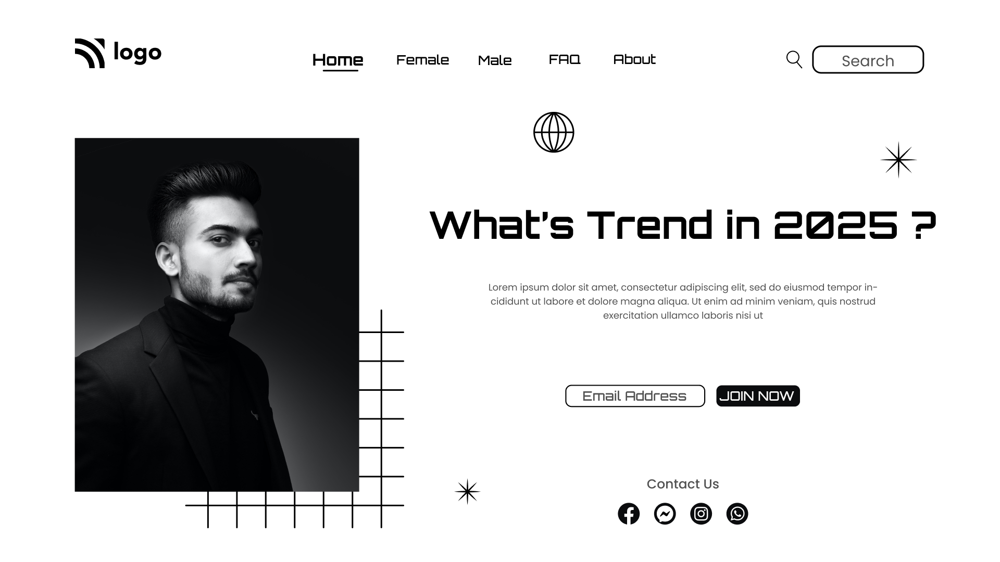

# Interior Design Landing Page  

## [Live Preview](http://project-1-ivory.vercel.app/) :link:

## Project Goal :dart:

The Objective of this project was to style the webpage as shown in the mockup provided, without modifying the html.

## Skills Gained

- Using `position` property.
- Implementing `position:relative` and `position:absolute`.
- z-index usage

## Time Taken

```
2 Hours
```

## Intended Outcome:



> This project is part of full stack Javascript web-dev bootcamp hosted by [iNeuron.](https://ineuron.ai/)
